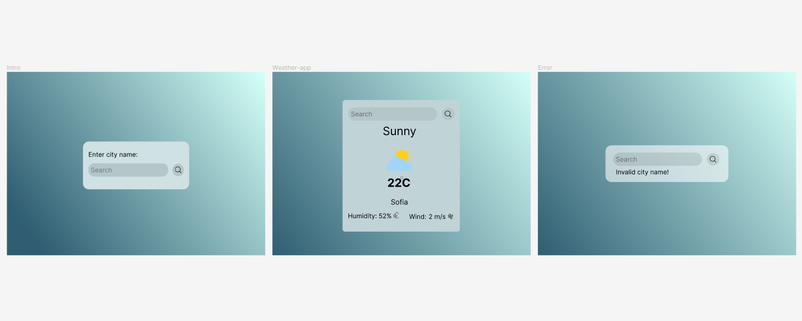
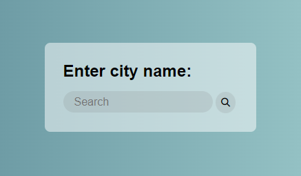
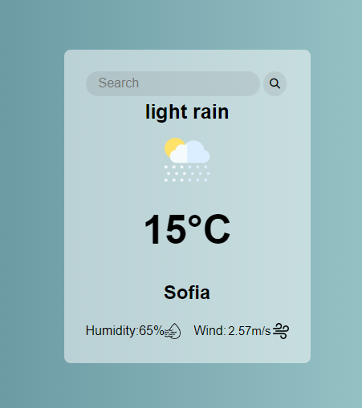
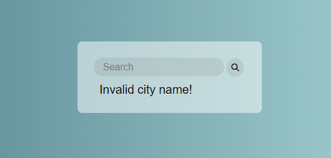

### Weather-app

This project has very simple and cleaned UI.
For the background is used linear color gradient with **D3FFF7** and **2F5E72**(HEX).
For the container background color is used **white** with  50% decreased opacity.
And for buttons and input background color: **#7c7c7c2b** with decreased opacity.

If nothing is entered in the text field and the button is clicked nothing happens.

(UI when the app is loaded and nothing is still typed.)

After a city name is searched the data gets displayed on the screen or 

if the name is wrong only error message is displayed.

For the Fetch data I used **https://openweathermap.org/** Website.
Thanks to their service I use real-time data on my project.

~Last update: 25.04.2023